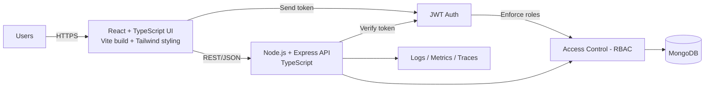
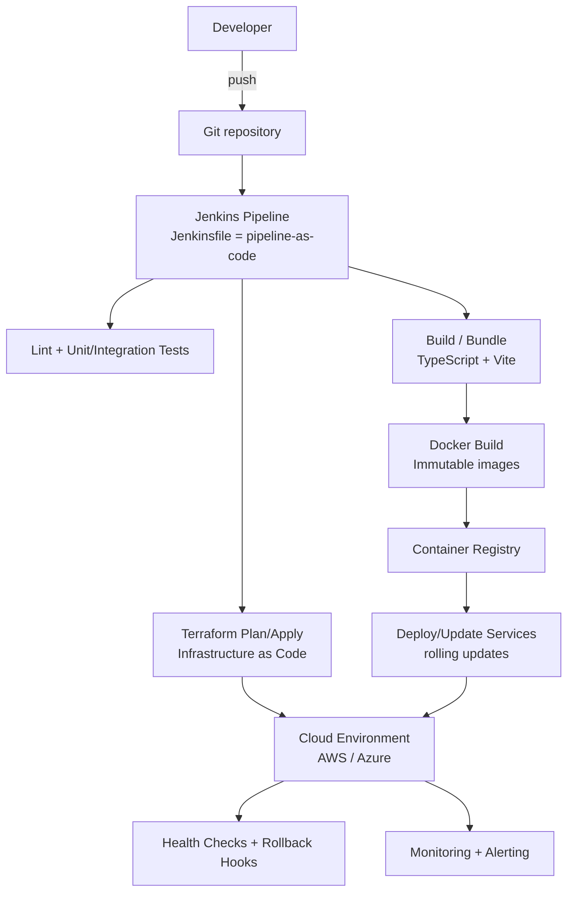

# Ali Achille Traoré

**DevOps Engineer | Full-Stack Software Engineer (MERN)**

I build cloud infrastructure, deployment workflows, and full-stack web applications.

Most of my production DevOps work has been delivered in private client and enterprise environments. This GitHub highlights my public software engineering projects, selected technical work, and the hands-on portfolio I use to demonstrate how I design, build, and troubleshoot systems.

## Core Areas

- Full-Stack Software Engineering (MERN)
- Cloud Infrastructure & Automation
- CI/CD & Deployment Reliability
- Containerization & Orchestration
- Infrastructure as Code
- Monitoring, Logging & Troubleshooting

## Public Work on GitHub

### Restaurant Deals
A full-stack MERN application built around restaurant promotions, user workflows, and role-based access.

### Selected Technical Practice
Additional repositories on this profile reflect technical practice across web development, JavaScript, Java, and deployment-related work.

## Background

I bring 6+ years of DevOps experience across cloud infrastructure, CI/CD, containerized environments, Infrastructure as Code, monitoring, and production support. My public GitHub is centered on full-stack software engineering with the MERN stack, along with selected technical work that reflects my broader background in automation, systems, and deployment.

## Engineering Architecture (Flow-Based)

### Runtime Flow (MERN)
How the application serves users in production (request → auth → data → response):

### Delivery Flow (DevOps)
How changes move from commit → pipeline → container → infrastructure → deployment → monitoring:

## Tech Stack (Mapped to Responsibilities)

This stack is organized into two “systems”: **runtime** (how requests are handled) and **delivery** (how changes ship safely).

### Runtime (Build the Product)

Frontend
- **React + TypeScript**: component-driven UI with type safety
- **Vite**: fast local dev + production bundling
- **Tailwind CSS**: consistent styling and UI iteration
- **Role-based UI**: navigation/visibility based on user role (UI convenience, not the security boundary)

Backend
- **Node.js + Express + TypeScript**: REST APIs, middleware, validation, error handling
- **JWT authentication**: stateless token-based auth for API requests
- **Access control (RBAC)**: server-side authorization checks for protected actions/resources

Data
- **MongoDB**: document data model for app entities, queries, indexing strategy

Operations
- **Logging/metrics/tracing**: telemetry to detect issues and troubleshoot production behavior

### Delivery (Ship Reliability)

CI/CD
- **Jenkins**: pipeline automation (build → test → package → deploy)
- **CI/CD discipline**: repeatable stages, artifact promotion, automated checks

Containers
- **Docker**: consistent packaging across dev/test/prod via immutable images

Infrastructure as Code
- **Terraform**: versioned infrastructure, repeatable environments, safer change management

Cloud Platforms
- **AWS / Azure**: compute, networking, storage, and managed services (depending on environment)

## Certifications

**View all badges:** [Credly Profile](https://www.credly.com/users/ali-achille-traore)

## Connect

- [LinkedIn](https://linkedin.com/in/ali-achille-traore)
- [Email](mailto:ali.achille.traore@gmail.com)
- [GitHub](https://github.com/traliach)

## Open To

DevOps, Cloud, and Full-Stack Software Engineering opportunities.
