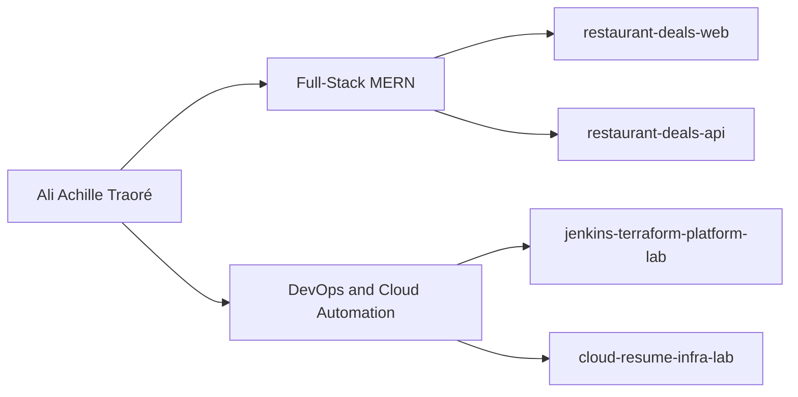

# Ali Achille Traoré

**DevOps Engineer | Full-Stack Software Engineer (MERN)**

I build cloud infrastructure, deployment workflows, and full-stack web applications.

Most of my production DevOps work has been delivered in private client and enterprise environments. This GitHub highlights my public software engineering projects, selected technical work, and the hands-on portfolio I use to demonstrate how I design, build, and troubleshoot systems.

## Core Areas

- Full-Stack Software Engineering (MERN)
- Cloud Infrastructure & Automation
- CI/CD & Deployment Reliability
- Containerization & Orchestration
- Infrastructure as Code
- Monitoring, Logging & Troubleshooting

## Public Work on GitHub

### Restaurant Deals
A full-stack MERN application built around restaurant promotions, user workflows, and role-based access.

### Selected Technical Practice
Additional repositories on this profile reflect technical practice across web development, JavaScript, Java, and deployment-related work.

## Background

I bring 6+ years of DevOps experience across cloud infrastructure, CI/CD, containerized environments, Infrastructure as Code, monitoring, and production support. My public GitHub is centered on full-stack software engineering with the MERN stack, along with selected technical work that reflects my broader background in automation, systems, and deployment.

## Architecture Snapshot

## Certifications

**View all badges:** [Credly Profile](https://www.credly.com/users/ali-achille-traore)

## Connect

- [LinkedIn](https://linkedin.com/in/ali-achille-traore)
- [Email](mailto:ali.achille.traore@gmail.com)
- [GitHub](https://github.com/traliach)

## Open To

DevOps, Cloud, and Full-Stack Software Engineering opportunities.
