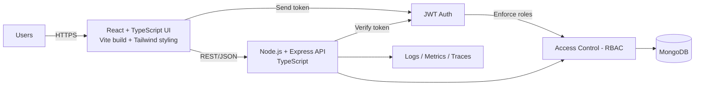
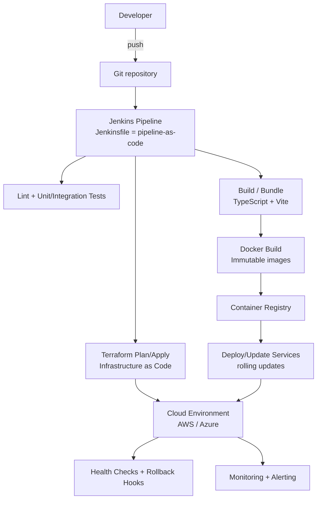

## Connect

- [LinkedIn](https://linkedin.com/in/achille-traore)
- [Email](mailto:t.achille.tech@gmail.com)
- [Portfolio](https://achille.tech)

## Open To

## Open To

Primary: DevOps Engineer · Cloud Infrastructure · Platform Engineering

Secondary: Full-Stack Software Engineering (MERN)

# Achille Traoré

**DevOps Engineer | Full-Stack Software Engineer (MERN)**

I design and automate cloud infrastructure, build CI/CD pipelines, and develop full-stack web applications.

Most of my production DevOps work has been delivered in private client and enterprise environments. This GitHub highlights my public software engineering projects, selected technical work, and the infrastructure labs I build to demonstrate operational depth.

## Core Areas

- Cloud Infrastructure & Automation
- CI/CD & Deployment Reliability
- Containerization & Orchestration
- Infrastructure as Code
- Monitoring, Logging & Troubleshooting
- Full-Stack Software Engineering (MERN)

## GitHub Stats

  

## Public Work on GitHub

### DevOps Lab Projects
Production-grade infrastructure projects built to demonstrate real operational depth — not just functional, but observable, secured, and recoverable.

**Kubernetes Platform Lab**
k3s cluster with ArgoCD App of Apps pattern, Helm chart deployments, per-namespace RBAC, network policies across 3 namespaces, PodDisruptionBudgets, and Prometheus alerting. Passed 21/21 health checks. Disaster recovery confirmed ~30-min RTO.
**Stack:** Kubernetes · k3s · ArgoCD · Helm · Prometheus · RBAC · Linux · Bash
**Repository:** [traliach/k8s-platform-lab](https://github.com/traliach/k8s-platform-lab)

**DevOps Platform Lab**
Self-hosted Jenkins CI/CD platform provisioned via Ansible with JCasC — no manual UI configuration. Ansible Vault AES256 secret management. Prometheus alerting with JenkinsDown alert verified firing. End-to-end pipeline runs in ~46 seconds.
**Stack:** Jenkins · JCasC · Ansible · Ansible Vault · Docker Compose · Prometheus · Bash
**Repository:** [traliach/devops-platform-lab](https://github.com/traliach/devops-platform-lab)

**Cloud Resume Infrastructure**
Full-stack cloud-native resume platform live at resume.achille.tech. React 19 + TypeScript + Vite + Tailwind frontend. Python Lambda backend. Terraform-provisioned AWS infrastructure. 3 active CloudWatch alarms and SNS alerting.
**Stack:** React · TypeScript · Terraform · AWS Lambda · CloudWatch · SNS · S3 · GitHub Actions
**Repository:** [traliach/cloud-resume-infra](https://github.com/traliach/cloud-resume-infra)

### achille.dev — Full-Stack Portfolio Platform
A full-stack portfolio platform built to showcase engineering work through a polished public frontend and a structured backend-driven content system. It combines React, TypeScript, Vite, Tailwind CSS, Express, and MongoDB into a cohesive full-stack architecture with admin-managed content, contact workflows, and deployment-ready configuration.

**Stack:** React, TypeScript, Vite, Tailwind CSS, Express, MongoDB  
**Highlights:** admin-managed content, portfolio UX, contact/testimonial workflows, secure auth, deployment-ready setup  
**Repository:** [traliach/achille.dev](https://github.com/traliach/achille.dev)

### Restaurant Deals — MERN Marketplace Application
A full-stack marketplace application centered on restaurant promotions, owner workflows, admin moderation, and customer-facing deal discovery. It includes role-based access control, REST API design, and a full MERN architecture split across a dedicated API and web client.

**Stack:** React, TypeScript, Node.js, Express, MongoDB, JWT, RBAC  
**Highlights:** moderation workflows, role-based access control, REST API design, full-stack architecture  
**Repositories:** [API](https://github.com/traliach/restaurant-deals-api) · [Web](https://github.com/traliach/restaurant-deals-web)

### Selected Technical Practice
Additional repositories on this profile reflect hands-on work across web development, JavaScript, Java, cloud tooling, and deployment-oriented engineering.

## Background

I bring 8+ years of DevOps experience across cloud infrastructure, CI/CD, containerized environments, Infrastructure as Code, monitoring, and production support. My public GitHub is centered on full-stack software engineering projects and infrastructure labs that demonstrate real operational depth.

## Engineering Architecture (Flow-Based)

### Runtime Flow (MERN)
How the application serves users in production (request → auth → data → response):

### Delivery Flow (DevOps)
How changes move from commit → pipeline → container → infrastructure → deployment → monitoring:

## Tech Stack (Mapped to Responsibilities)

This stack is organized into two systems: **runtime** (how requests are handled) and **delivery** (how changes ship safely).

### Runtime (Build the Product)

Application
- **React + TypeScript**: component-driven UI with type safety
- **Vite**: fast local development and production bundling
- **Tailwind CSS**: consistent styling and fast UI iteration
- **Node.js + Express + TypeScript**: REST APIs, middleware, validation, and backend workflow handling
- **JWT + RBAC**: stateless authentication and server-side access control

Data and Storage
- **MongoDB + Mongoose**: document data model for MERN applications
- **PostgreSQL / RDS**: relational workloads and managed database operations
- **DynamoDB / Redshift / Aurora / Oracle**: broader database exposure across cloud and enterprise environments
- **S3 / object storage concepts**: static assets, storage integration, and cloud-based data workflows

Operations
- **Logging / metrics / tracing**: production visibility, troubleshooting, and operational feedback loops

### Delivery (Ship Reliability)

CI/CD and Automation
- **Jenkins / GitHub Actions / GitLab CI / Azure DevOps**: pipeline automation, build orchestration, and deployment workflows
- **Terraform / CloudFormation / Ansible**: Infrastructure as Code, configuration automation, and repeatable environments

Containers and Platforms
- **Docker / Docker Compose**: consistent packaging across development, test, and production
- **Kubernetes / OpenShift**: container orchestration and platform operations
- **Linux / Bash / Python**: scripting, automation, and systems troubleshooting

Cloud Platforms
- **AWS / Azure**: compute, networking, storage, IAM, and managed cloud services

## Certifications

**View all badges:** [Credly Profile](https://www.credly.com/users/ali-achille-traore)
